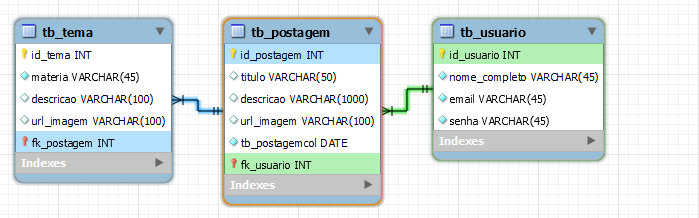

<h1 align= "center" >
    # Rede social Educamus Projeto integrador
</h1>

Tema do projeto integrador: **[ODS 4 DA ONU: EDUCAÇÃO DE QUALIDADE](https://brasil.un.org/pt-br/sdgs/4)**

Grupo: Giovana, Robert, Thiago, Anderson, Augusto

**[Prototipando o Banco de dados](https://drive.google.com/file/d/1e_6BWoMTYKMxYNF9DhsPaWhGvOgVeQX1/view)** 🆗

 
 

**[Apostila Projeto Integrador 2021](https://drive.google.com/file/d/17n6vtRHIB_vMhRbG-nDkHwJsK4QUuXdN/view)**

 
 

<h3 align= "center" >
Preview : 
</h3>

